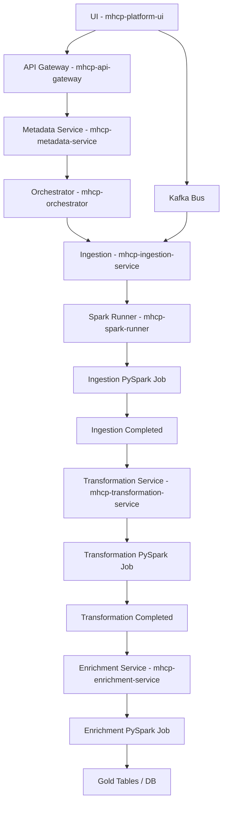

# MDHP Architecture (Mermaid)

```mermaid
graph TD
  UI[UI - mhcp-platform-ui] --> Gateway[API Gateway - mhcp-api-gateway]
  Gateway --> Metadata[Metadata Service - mhcp-metadata-service]
  Metadata --> Orchestrator[Orchestrator - mhcp-orchestrator]
  Orchestrator --> Ingestion[Ingestion - mhcp-ingestion-service]
  Ingestion --> SparkRunner[Spark Runner - mhcp-spark-runner]
  SparkRunner --> IngestJob[Ingestion PySpark Job]
  IngestJob --> IngestCompleted[Ingestion Completed]
  IngestCompleted --> Transform[Transformation Service - mhcp-transformation-service]
  Transform --> TransformJob[Transformation PySpark Job]
  TransformJob --> TransformCompleted[Transformation Completed]
  TransformCompleted --> Enrichment[Enrichment Service - mhcp-enrichment-service]
  Enrichment --> EnrichJob[Enrichment PySpark Job]
  EnrichJob --> Gold[Gold Tables / DB]
  UI --> Kafka[Kafka Bus]
  Kafka --> Ingestion
```
