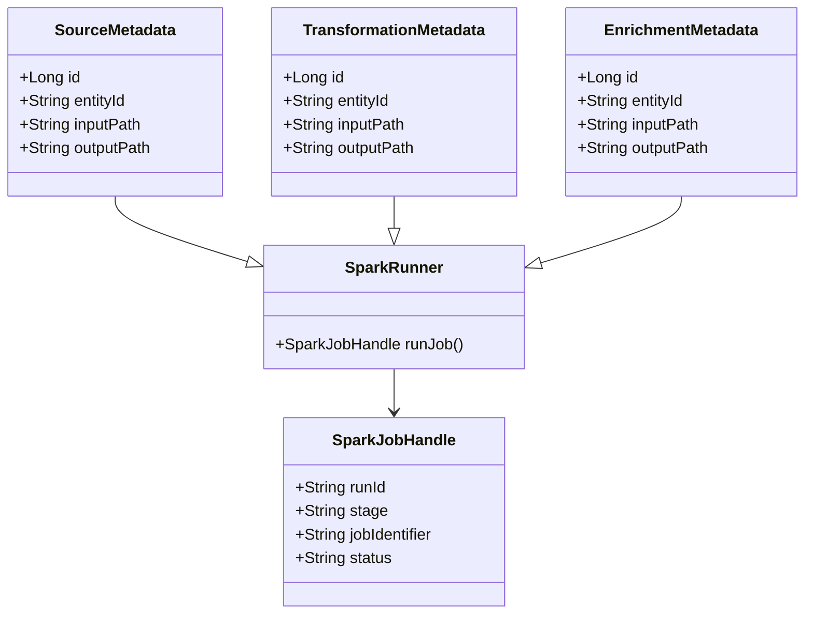

```mermaid
classDiagram
class SourceMetadata {
  +Long id
  +String entityId
  +String inputPath
  +String outputPath
}
class TransformationMetadata {
  +Long id
  +String entityId
  +String inputPath
  +String outputPath
}
class EnrichmentMetadata {
  +Long id
  +String entityId
  +String inputPath
  +String outputPath
}
class SparkRunner {
  +SparkJobHandle runJob()
}
class SparkJobHandle {
  +String runId
  +String stage
  +String jobIdentifier
  +String status
}
SourceMetadata --|> SparkRunner
TransformationMetadata --|> SparkRunner
EnrichmentMetadata --|> SparkRunner
SparkRunner --> SparkJobHandle
```
