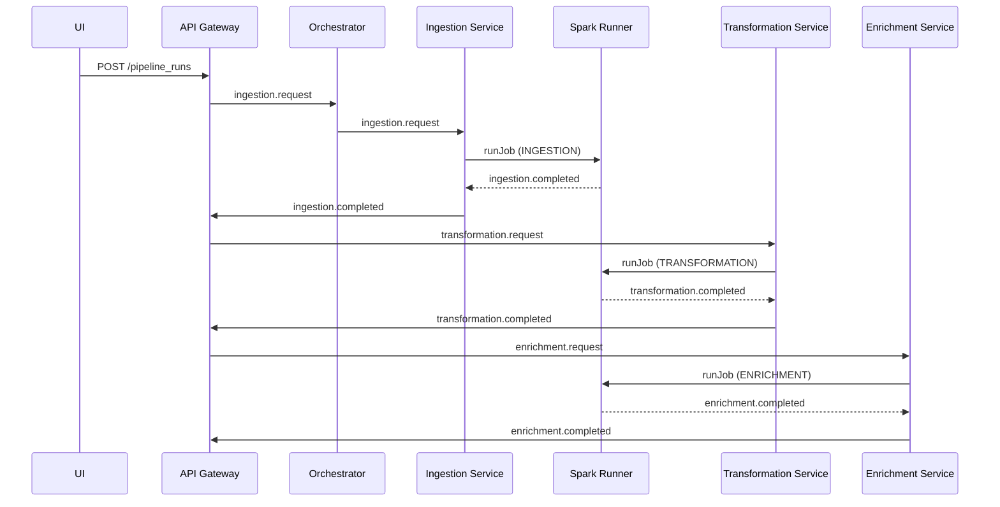

```mermaid
sequenceDiagram
  participant UI as UI
  participant GW as API Gateway
  participant OR as Orchestrator
  participant IN as Ingestion Service
  participant SP as Spark Runner
  participant TRANS as Transformation Service
  participant ENR as Enrichment Service

  UI->>GW: POST /pipeline_runs
  GW->>OR: ingestion.request
  OR->>IN: ingestion.request
  IN->>SP: runJob (INGESTION)
  SP-->>IN: ingestion.completed
  IN->>GW: ingestion.completed
  GW->>TRANS: transformation.request
  TRANS->>SP: runJob (TRANSFORMATION)
  SP-->>TRANS: transformation.completed
  TRANS->>GW: transformation.completed
  GW->>ENR: enrichment.request
  ENR->>SP: runJob (ENRICHMENT)
  SP-->>ENR: enrichment.completed
  ENR->>GW: enrichment.completed
```
